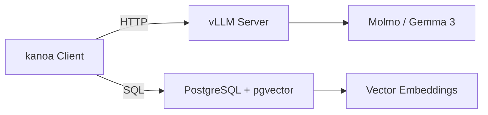

# kanoa-mlops Infrastructure Spec

## Purpose

`kanoa-mlops` provides the infrastructure ("brawn") for local AI interpretation, complementing the lightweight `kanoa` client library ("brain").

## Scope

### In Scope

- **vLLM Serving**: Docker-based inference for open-source models (Molmo, Gemma 3, Llama 3)
- **Vector Database**: PostgreSQL + pgvector for RAG
- **Model Management**: Download scripts, caching strategies
- **Deployment Configs**: Docker Compose (local), Kubernetes (production)

### Out of Scope

- **Client Logic**: Retrieval, prompt construction (owned by `kanoa`)
- **Proprietary APIs**: Gemini, Claude, OpenAI (accessed directly by `kanoa`)

## Architecture

## Phase 1: vLLM Serving (Complete)

- [x] Docker Compose setup
- [x] Model download scripts (Molmo, Gemma 3)
- [x] Health checks and monitoring
- [x] Example quickstart scripts

## Phase 2: RAG Infrastructure (Planned)

- [ ] PostgreSQL + pgvector service
- [ ] Schema initialization scripts
- [ ] Embedding model serving
- [ ] Example RAG pipelines

## Phase 3: Production Deployment (Future)

- [ ] Kubernetes manifests
- [ ] Helm charts
- [ ] Observability stack (Prometheus, Grafana)
- [ ] Auto-scaling configurations

## Hardware Requirements

### Minimum (Development)

- **GPU**: NVIDIA with 12GB VRAM (e.g., RTX 3060)
- **RAM**: 16GB
- **Storage**: 50GB for models

### Recommended (Production)

- **GPU**: NVIDIA A100 (40GB) or H100
- **RAM**: 64GB+
- **Storage**: 500GB NVMe SSD

## Supported Models

| Model | Size | VRAM | Use Case |
| :--- | :--- | :--- | :--- |
| Molmo-7B-D | 7B | 12GB | Vision + Text |
| Gemma 3 12B | 12B | 24GB | Text reasoning |
| Llama 3.1 8B | 8B | 16GB | General purpose |

## Dependencies

- **Docker**: 24.0+
- **Docker Compose**: 2.20+
- **NVIDIA Container Toolkit**: Latest
- **CUDA**: 12.1+

## Security Considerations

- Models stored in read-only volumes
- No secrets in Docker images
- Network isolation for production deployments
