# Local GPU Metrics Monitoring Stack

Prometheus + Grafana stack for monitoring vLLM GPU utilization and inference metrics on local and remote endpoints.

## Overview

This monitoring stack provides:

- **Prometheus**: Time-series metrics collection from vLLM `/metrics` endpoint
- **Grafana**: Visualization dashboards for GPU metrics, request rates, and throughput
- **Persistent Storage**: Data survives container restarts
- **Extensible**: Ready to add remote GCP/Azure endpoints

## Architecture

```mermaid
graph TD
    A["vLLM Server<br/>(port 8000)"]
    B["Prometheus<br/>(port 9090)"]
    C["Grafana<br/>(port 3000)"]
    
    A -->|/metrics endpoint<br/>Prometheus format| B
    B -->|scrapes every 15s<br/>stores 30 days| C
    C -->|queries Prometheus<br/>displays dashboards| D["📊 Dashboards"]
```



The monitoring stack runs independently from vLLM, so it survives vLLM restarts.

## Quick Start

### 1. Start the Monitoring Stack

From the project root:

```bash
docker compose -f docker-compose.monitoring.yml up -d
```

This will start both Prometheus and Grafana containers.

### 2. Verify Services

Check that both services are running:

```bash
docker compose -f docker-compose.monitoring.yml ps
```

You should see:

```
NAME                 STATUS    PORTS
kanoa-prometheus     Up        0.0.0.0:9090->9090/tcp
kanoa-grafana        Up        0.0.0.0:3000->3000/tcp
```

### 3. Access Grafana

Open your browser to: http://localhost:3000

**Default credentials:**
- Username: `admin`
- Password: `admin`

(You'll be prompted to change the password on first login)

### 4. View Dashboard

The vLLM GPU Metrics dashboard should be automatically provisioned:

1. Click "Dashboards" in the left sidebar
2. Navigate to "vLLM" folder
3. Open "vLLM GPU Metrics"

### 5. Start Your vLLM Server

Make sure your vLLM server is running on port 8000:

```bash
# Example with Gemma 3 12B
vllm serve google/gemma-3-12b-it --port 8000

# Or with Docker Compose (if you have kanoa-mlops)
docker compose -f docker/vllm/docker-compose.gemma.yml up -d
```

Within 15 seconds, Prometheus will start scraping metrics and Grafana will display them.

## Available Dashboards

### vLLM GPU Metrics

Pre-built dashboard showing:

- **GPU KV Cache Usage**: Current cache utilization (gauge)
- **Request Rate**: Running and waiting requests per second
- **Active Requests**: Number of currently running requests
- **Token Throughput**: Generation and prompt processing speed (tok/s)
- **Latency Metrics**: Time to first token, time per output token
- **Cache Utilization**: GPU and CPU cache usage over time
- **Request Preemptions**: Total preemptions and rate

The dashboard auto-refreshes every 5 seconds.

## Accessing Services

| Service | URL | Purpose |
|---------|-----|---------|
| Grafana | http://localhost:3000 | View dashboards |
| Prometheus | http://localhost:9090 | Query metrics, check targets |
| vLLM Metrics | http://localhost:8000/metrics | Raw Prometheus metrics |

## Managing the Stack

### View Logs

```bash
# All services
docker compose -f docker-compose.monitoring.yml logs -f

# Prometheus only
docker compose -f docker-compose.monitoring.yml logs -f prometheus

# Grafana only
docker compose -f docker-compose.monitoring.yml logs -f grafana
```

### Stop the Stack

```bash
docker compose -f docker-compose.monitoring.yml down
```

**Note:** This stops the containers but preserves data in volumes.

### Stop and Remove Data

```bash
# WARNING: This deletes all metrics and Grafana configurations
docker compose -f docker-compose.monitoring.yml down -v
```

### Restart Services

```bash
docker compose -f docker-compose.monitoring.yml restart
```

## Configuration

### Prometheus

Configuration file: [prometheus/prometheus.yml](./prometheus/prometheus.yml)

**Key settings:**
- Scrape interval: 15 seconds
- Retention: 30 days
- Targets:
  - Local vLLM: `host.docker.internal:8000/metrics`
  - Prometheus self-monitoring: `localhost:9090`

**To modify scrape interval:**

Edit `prometheus/prometheus.yml`:

```yaml
global:
  scrape_interval: 10s  # Change to desired interval
```

Then restart Prometheus:

```bash
docker compose -f docker-compose.monitoring.yml restart prometheus
```

### Grafana

**Datasource provisioning:** [grafana/provisioning/datasources/prometheus.yml](./grafana/provisioning/datasources/prometheus.yml)

**Dashboard provisioning:** [grafana/provisioning/dashboards/dashboard-provider.yml](./grafana/provisioning/dashboards/dashboard-provider.yml)

**Dashboards:** [grafana/dashboards/](./grafana/dashboards/)

All configurations are automatically loaded when Grafana starts.

## Adding Remote Endpoints

To monitor a remote vLLM server (e.g., GCP, Azure):

### 1. Edit Prometheus Configuration

Edit [prometheus/prometheus.yml](./prometheus/prometheus.yml) and uncomment the GCP section:

```yaml
# Example: Add GCP remote endpoint
- job_name: 'vllm-gcp'
  scrape_interval: 30s
  scrape_timeout: 15s
  metrics_path: '/metrics'
  static_configs:
    - targets: ['<GCP_EXTERNAL_IP>:8000']
      labels:
        instance: 'vllm-gcp'
        cloud: 'gcp'
        region: 'us-central1'
        model: 'gemma-3-12b'
        environment: 'production'
```

Replace `<GCP_EXTERNAL_IP>` with your actual IP address.

### 2. Optional: Add Authentication

If your remote endpoint requires authentication:

```yaml
- job_name: 'vllm-gcp'
  static_configs:
    - targets: ['<GCP_EXTERNAL_IP>:8000']
  basic_auth:
    username: 'prometheus'
    password: 'your-password'  # Or use password_file
```

### 3. Optional: Add TLS

For secure HTTPS connections:

```yaml
- job_name: 'vllm-gcp'
  static_configs:
    - targets: ['<GCP_EXTERNAL_IP>:8000']
  tls_config:
    ca_file: '/etc/prometheus/certs/ca.crt'
    cert_file: '/etc/prometheus/certs/client.crt'
    key_file: '/etc/prometheus/certs/client.key'
```

Mount certificates in `docker-compose.monitoring.yml`:

```yaml
services:
  prometheus:
    volumes:
      - ./monitoring/prometheus/certs:/etc/prometheus/certs:ro
```

### 4. Reload Configuration

```bash
# Reload Prometheus config without restart
docker exec kanoa-prometheus kill -HUP 1

# Or restart the container
docker compose -f docker-compose.monitoring.yml restart prometheus
```

### 5. Verify Target

1. Open http://localhost:9090/targets
2. Check that your new target appears and is "UP"
3. If "DOWN", check logs: `docker compose -f docker-compose.monitoring.yml logs prometheus`

## Troubleshooting

### vLLM Target Shows "DOWN" in Prometheus

**Check if vLLM is running:**

```bash
curl http://localhost:8000/health
```

**Check metrics endpoint:**

```bash
curl http://localhost:8000/metrics
```

You should see Prometheus-format metrics like:

```
# HELP vllm:num_requests_running Number of requests currently running
# TYPE vllm:num_requests_running gauge
vllm:num_requests_running 0.0
```

**Check Prometheus can reach vLLM:**

From inside the Prometheus container:

```bash
docker exec kanoa-prometheus wget -O- http://host.docker.internal:8000/metrics
```

### No Data in Grafana Dashboard

**Verify Prometheus datasource:**

1. In Grafana, go to Configuration > Data Sources
2. Click "Prometheus"
3. Click "Test" button at bottom
4. Should show "Data source is working"

**Check Prometheus has data:**

1. Open http://localhost:9090
2. Enter query: `vllm:num_requests_running`
3. Click "Execute"
4. If no data, vLLM may not be running or not exposing metrics

**Check dashboard queries:**

1. In Grafana dashboard, click panel title
2. Select "Edit"
3. Check "Query" tab for errors

### Grafana Won't Start

**Check logs:**

```bash
docker compose -f docker-compose.monitoring.yml logs grafana
```

**Common issues:**
- Port 3000 already in use: Change port in `docker-compose.monitoring.yml`
- Permission issues: Check volume permissions

### Prometheus Storage Full

By default, Prometheus retains 30 days of data. To adjust:

Edit `docker-compose.monitoring.yml`:

```yaml
services:
  prometheus:
    command:
      - '--storage.tsdb.retention.time=15d'  # Reduce to 15 days
```

Or clear old data:

```bash
docker compose -f docker-compose.monitoring.yml down
docker volume rm kanoa_prometheus-data
docker compose -f docker-compose.monitoring.yml up -d
```

### WSL2 Specific: host.docker.internal Not Working

If you're on WSL2 and Prometheus can't reach vLLM via `host.docker.internal`:

**Option 1: Use WSL IP address**

Find your WSL IP:

```bash
ip addr show eth0 | grep inet | awk '{print $2}' | cut -d/ -f1
```

Edit [prometheus/prometheus.yml](./prometheus/prometheus.yml):

```yaml
- job_name: 'vllm-local'
  static_configs:
    - targets: ['172.x.x.x:8000']  # Replace with your WSL IP
```

**Option 2: Use host network mode**

Edit `docker-compose.monitoring.yml`:

```yaml
services:
  prometheus:
    network_mode: host
    # Remove ports section when using host mode
```

## vLLM Metrics Reference

Common vLLM metrics available:

| Metric | Type | Description |
|--------|------|-------------|
| `vllm:gpu_cache_usage_perc` | Gauge | GPU KV cache utilization (0-100%) |
| `vllm:cpu_cache_usage_perc` | Gauge | CPU cache utilization (0-100%) |
| `vllm:num_requests_running` | Gauge | Currently running requests |
| `vllm:num_requests_waiting` | Gauge | Requests waiting in queue |
| `vllm:avg_generation_throughput_toks_per_s` | Gauge | Token generation speed |
| `vllm:avg_prompt_throughput_toks_per_s` | Gauge | Prompt processing speed |
| `vllm:time_to_first_token_seconds` | Gauge | Latency to first token |
| `vllm:time_per_output_token_seconds` | Gauge | Average time per output token |
| `vllm:num_preemptions_total` | Counter | Total request preemptions |

For full list, visit: http://localhost:8000/metrics when vLLM is running.

## Customizing Dashboards

### Edit Existing Dashboard

1. In Grafana, open the dashboard
2. Click the gear icon (⚙️) at top right
3. Make changes
4. Click "Save dashboard"

Changes persist in the Grafana database volume.

### Export Dashboard

1. Click "Share" icon at top
2. Select "Export" tab
3. Click "Save to file"
4. Save JSON to `monitoring/grafana/dashboards/`

### Import Dashboard

1. In Grafana, click "+" > "Import"
2. Upload JSON file or paste JSON
3. Select "Prometheus" as datasource
4. Click "Import"

## Data Persistence

Metrics and configurations are stored in Docker volumes:

```bash
# List volumes
docker volume ls | grep kanoa

# Inspect volume
docker volume inspect kanoa_prometheus-data
docker volume inspect kanoa_grafana-data

# Backup volumes (while stack is stopped)
docker run --rm -v kanoa_prometheus-data:/data -v $(pwd):/backup \
  alpine tar czf /backup/prometheus-backup.tar.gz -C /data .

docker run --rm -v kanoa_grafana-data:/data -v $(pwd):/backup \
  alpine tar czf /backup/grafana-backup.tar.gz -C /data .
```

## Performance Considerations

### Prometheus

- **Scrape interval**: Default 15s is good for most use cases
  - Lower (5-10s): More granular data, higher storage usage
  - Higher (30-60s): Less granular, lower storage usage

- **Retention**: Default 30 days
  - Disk usage: ~1-2GB per month for single vLLM instance
  - Adjust based on available disk space

### Grafana

- **Refresh rate**: Dashboard defaults to 5s auto-refresh
- Change via dropdown at top right of dashboard
- For production monitoring, 10-30s is usually sufficient

## Security Notes

### Local Development

For local development, default settings are fine:
- Grafana: admin/admin (change on first login)
- Prometheus: No authentication
- Network: Bridge network (isolated from host)

### Production Deployment

If exposing to network, consider:

1. **Change Grafana admin password**
2. **Enable Grafana authentication**:
   - LDAP, OAuth, or basic auth
   - See [Grafana auth docs](https://grafana.com/docs/grafana/latest/setup-grafana/configure-security/configure-authentication/)

3. **Secure Prometheus**:
   - Use reverse proxy with authentication
   - Restrict network access
   - Enable TLS

4. **Use TLS for remote endpoints**
5. **Restrict Docker network access**

## Additional Resources

- [Prometheus Documentation](https://prometheus.io/docs/)
- [Grafana Documentation](https://grafana.com/docs/)
- [vLLM Metrics Documentation](https://docs.vllm.ai/en/latest/serving/metrics.html)
- [kanoa vLLM Backend Guide](../docs/source/backends/vllm.md)
- [kanoa-mlops Repository](https://github.com/lhzn-io/kanoa-mlops)

## License

Same as parent project (MIT).
